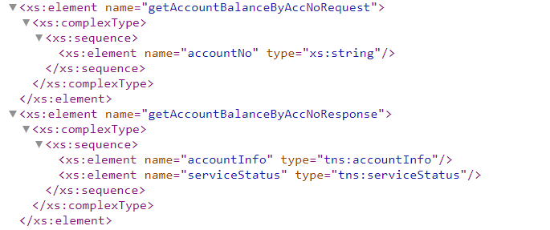
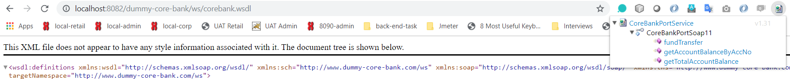
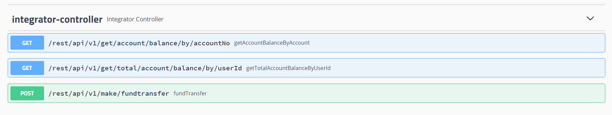

# Dummy-Core-Bank-System-with-Integrator-Service
Back-end developer task (dummy core banking system and rest integrator service), as a SOAP web services and Integrator service as a REST Api.

## Development Methodology

### Core Bank Dummy

#### Tools and Technology Stack for core bank dummy.

JDK 1.8, Intellij , Maven – Development environment 
Spring-boot – Underlying application framework  
maven-jaxb2-plugin plugin – for JAXB stub generation and Mapping  
(H2 In-memory database + Java Persistence API) - for memory management  
SOAP UI and Wizdler browser plugin - to test SOAP end points  

##### Important Development Steps

SOAP Web Service created with the Spring Boot Starter Web Services. when creating the SOAP services use the contract first approach and define the XSD for the request and response. 
/src/main/resources/core-bank-details.xsd

##### Sample get account balance request and response.  

To do the mapping from XML to Java and Java to XML, JAXB (Java API for XML binding) used. 
To generate the the Java objects based on the XSD Maven JAXB Plugin defined in the pom.xml. also wsdl4j dependency added to the pom.xml to generate the WSDl with spring web services.

##### URL of the WSDL - http://localhost:8082/dummy-core-bank/ws/corebank.wsdl

Wizdler browser plugin and SOAP-UI used to test the SOAP end points during the development time.  

 

 H2 In-memory database used for the manage data in memory,  with spring boot + SOAP web services.
 
##### URL of the H2 databse console - http://localhost:8082/dummy-core-bank/h2/login.jsp (username/password - root)

###### SERVER CONFIGURATIONS  
server.port=8082  
server.servlet.context-path=/dummy-core-bank  
 
 ### Integrator Service (Spring boot soap client with rest APIs)

#### Tools and Technology Stack for core integrator Service.

JDK 1.8, Intellij , Maven – Development environment 
Spring-boot – Underlying application framework  
maven-jaxb2-plugin plugin – for JAXB stub generation and Mapping  
(mysql + Java Persistence API)  - to save audit events 
swagger-ui - to test rest end points
  

##### Important Development Steps

Spring boot soap client created with the Spring Boot Starter Web Services and to generate client proxy code
use the maven-jaxb2-plugin and generated the JAXB annotated stub classes.
 
resources/wsdl/corebank.wsdl

##### URL of the swagger Ui - http://localhost:8083/integrator-service/swagger-ui.html

##### Exposed rest end points. 

 

###### SERVER CONFIGURATIONS   
server.port=8083  
server.servlet.context-path=/integrator-service  

## Test Core Bank Dummy System 
#### Build Commands for Appolication
##### mvn clean install - to build the Dummy core bank system and Integrator service use maven build commands.
## Run Commands

#####  java -jar dcbs-0.0.1-SNAPSHOT.jar - to run dummy core bank SOAP web services
##### java -jar integrator-service-0.0.1-SNAPSHOT.jar - to run dummy Integrator Service

##### Exposed rest end points. 

###### Get account balance of particular account - @GetMapping
###### URL  - http://localhost:8083/integrator-service/rest/api/v1/get/account/balance/by/accountNo
###### Expected paramer name - accountNo
return the account balance of particular account if exists in the dummy core bank database other wise return service messages with error.

###### Get total account balance - @GetMapping
###### URL  - http://localhost:8083/integrator-service/rest/api/v1/get/total/account/balance/by/userId
###### Expected paramer name - userId
return the total account balance of particular user if exists in the dummy core bank database other wise return error messages.

###### Get total account balance - @GetMapping
###### URL  - http://localhost:8083/integrator-service/rest/api/v1/get/total/account/balance/by/userId
###### Expected paramer name - userId
return the total account balance of particular user if exists in the dummy core bank database other wise return error messages.

